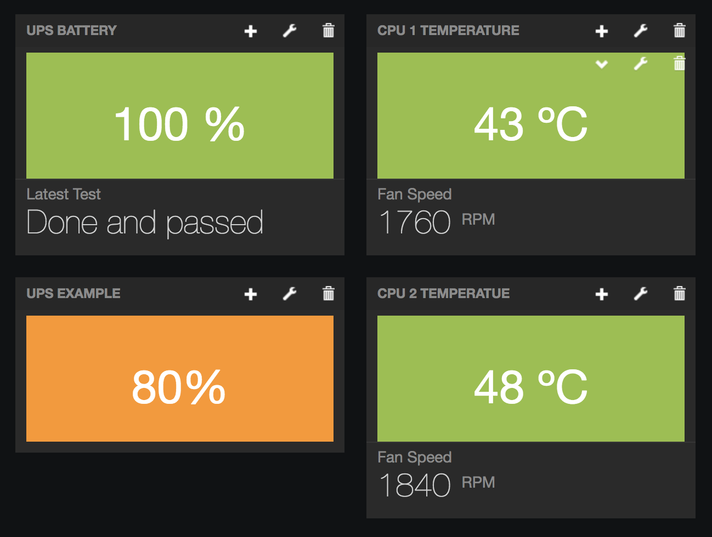
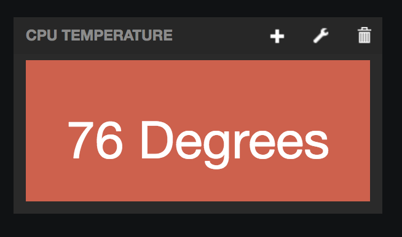
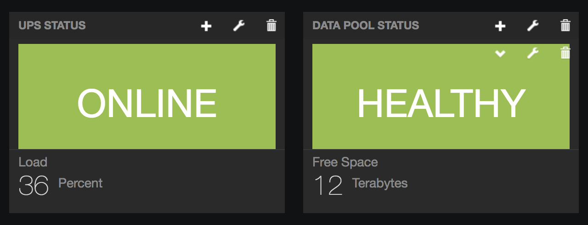
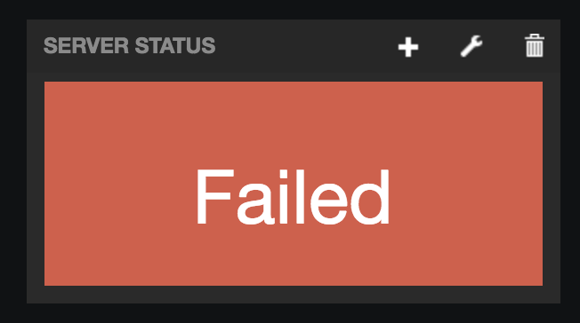

Freeboard Plugins
=================

These are my plugins for [Freeboard][fb]. 

[fb]: https://github.com/Freeboard/freeboard

## Installation

Add the `.js` files in the index.html file at the top near the head.js script 
loader, like this:
```html
    <script type="text/javascript">
        head.js("js/freeboard_plugins.min.js",
                "plugins/colorblocks/colorvalue.js",
                "plugins/colorblocks/colorthreshold.js",
                // *** Load more plugins here ***
```

## Color Blocks Widgets
Colorblocks give a bright color status based on a computed value. There are two
widgets, colorthreshold.js and colorvalue.js.

__colorthreshold.js__ lets you set a computed value, good/bad values, and customize
good/warning/bad colors. The grading of good and bad values can be inverted.




__colorvalue.js__ lets you set a computed value, good value, and customise good/bad
colors.





